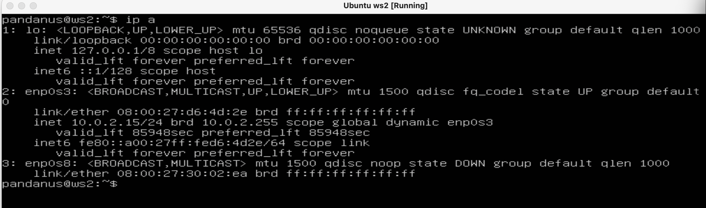
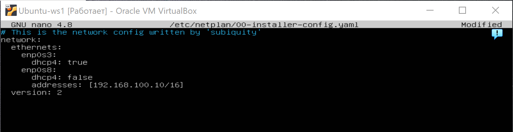

# Сети в Linux

Настройка сетей в Linux на виртуальных машинах.


## Contents

1. [Part 1. Инструмент ipcalc](#part-1-инструмент-ipcalc)
2. [Part 2. Статическая маршрутизация между двумя машинами ](#part-2-статическая-маршрутизация-между-двумя-машинами)
3. [Part 3. Утилита iperf3](#part-3-утилита-iperf3)
4. [Part 4. Сетевой экран](#part-4-сетевой-экран)
5. [Part 5. Статическая маршрутизация сети](#part-5-статическая-маршрутизация-сети)
6. [Part 6. Динамическая настройка IP с помощью DHCP](#part-6-динамическая-настройка-ip-с-помощью-dhcp)
7. [Part 7. NAT](#part-7-nat)
8. [Part 8. Дополнительно. Знакомство с SSH Tunnels](#part-8-дополнительно-знакомство-с-ssh-tunnels)

  
#### 1) Адрес сети 192.167.38.54/13  
* Для вывода адреса сети воспользуемся утилитой ipcalc, которую предварительно скачаем командой `sudo apt install ipcalc`.  
Далее введём команду `ipcalc -b 192.167.38.54/13`  
  
Флаг `-b` позволяет скрыть двоичный вывод.  

#### 2) Перевод маски 255.255.255.0 в префиксную и двоичную запись, /15 в обычную и двоичную, 11111111.11111111.11111111.11110000 в обычную и префиксную  
* Воспользуемся командой `ipcalc 255.255.255.0`  
  
Префиксная запись `/24`. Двоичная запись - `11111111.11111111.11111111.00000000`  


* Воспользуемся командой `ipcalc /15`  
 
Обычная запись - `255.254.0.0`. Двоичная запись - `11111111.11111110.00000000.00000000`  

  
* Посчитаем количество ненулевых бит в 11111111.11111111.11111111.11110000 и получим - 28. Воспользуемся командой `ipcalc 192.167.38.54/28`  
 
Обычная запись - `255.255.255.240`. Префиксная запись - `/28`.  

#### 3) Минимальный и максимальный хост в сети 12.167.38.4 при масках: /8, 11111111.11111111.00000000.00000000, /4  
* Воспользуемся командой `ipcalc 12.167.38.4/8`  
 
Минимальный хост - `12.0.0.1`. Максимальный хост - `12.255.255.254`.  


* Воспользуемся командой `ipcalc 12.167.38.4/16`  
 
Минимальный хост - `12.167.0.1`. Максимальный хост - `12.167.255.254`.  


* Воспользуемся командой `ipcalc 12.167.38.4/23`  
  
Минимальный хост - `12.167.38.1`. Максимальный хост - `12.167.39.254`.  


* Воспользуемся командой `ipcalc 12.167.38.4/4`  
 
Минимальный хост - `0.0.0.1`. Максимальный хост - `15.255.255.254`.  

### 1.2. Localhost  
#### Определить и записать в отчёт, можно ли обратиться к приложению, работающему на localhost, со следующими IP: 194.34.23.100, 127.0.0.2, 127.1.0.1, 128.0.0.1  
* Пишем в гугле "localhost" и в первой ссылке на википедию видим, что для localhost зарезервирован диапазон ip адресов от 127.0.0.1 до 127.255.255.254 включительно. Из этого можем сделать вывод, что мы сможем обратиться к приложениям, работающим со следующими ip: `127.0.0.2`, `127.1.0.1`.  
Проверим:  
* Воспользуемся командой `ipcalc 194.34.23.100`  
 
Интерфейс loopback отсутствует в строке "Hosts/Net", следовательно данный адрес нам не подходит.  


* Воспользуемся командой `ipcalc 127.0.0.2`  
 
Loopback присутствует, следовательно адрес нам подходит.  


* Воспользуемся командой `ipcalc 127.1.0.1`  
  
Loopback тоже есть, следовательно адрес нам подходит.  


* Воспользуемся командой `ipcalc 128.0.0.1`  
 
Loopback нет, адрес не подходит.  

### 1.3. Диапазоны и сегменты сетей  
#### 1) Какие из перечисленных IP можно использовать в качестве публичного, а какие только в качестве частных: 10.0.0.45, 134.43.0.2, 192.168.4.2, 172.20.250.4, 172.0.2.1, 192.172.0.1, 172.68.0.2, 172.16.255.255, 10.10.10.10, 192.169.168.1  
* Выведем информацию обо всех ip адресах с помощью команды `ipcalc <ip адрес>`  

 
Нас интересует строка "Hosts/Net" и конкретно надпись "Private Internet", наличие которой говорит о том, что ip адрес принадлежит частной сети.  
Вывод:  
* Адреса `10.0.0.45`, `192.168.4.2`, `172.20.250.4`, `172.16.255.255`, `10.10.10.10` можно использовать только в качестве частных.  
* Адреса `134.43.0.2`, `172.0.2.1`, `192.172.0.1`, `172.68.0.2`, `192.169.168.1` можно использовать в качестве публичных.  

#### 2) Какие из перечисленных IP адресов шлюза возможны у сети 10.10.0.0/18: 10.0.0.1, 10.10.0.2, 10.10.10.10, 10.10.100.1, 10.10.1.255  
* Воспользуемся командой `ipcalc -b 10.10.0.0/18`  
  
Возможны адреса `10.10.0.2`, `10.10.10.10` и `10.10.1.255`  

## Part 2. Статическая маршрутизация между двумя машинами  

#### Поднять две виртуальные машины (далее -- ws1 и ws2)
  

#### С помощью команды ip a посмотреть существующие сетевые интерфейсы  
* ws1  

* ws2  
  

#### Описать сетевой интерфейс, соответствующий внутренней сети, на обеих машинах и задать следующие адреса и маски: ws1 - 192.168.100.10, маска /16, ws2 - 172.24.116.8, маска /12  
* На обеих машинах выполняем команду `sudo nano /etc/netplan/00-installer-config.yaml` и вносим изменения.  
* ws1  
  
* ws2  
  

#### Выполнить команду netplan apply для перезапуска сервиса сети  
* ws1  
  
* ws2  

## Part 2. Статическая маршрутизация между двумя машинами
* Поднять две виртуальные машины (далее -- ws1 и ws2)
* С помощью команды ip a посмотреть существующие сетевые интерфейсы
    * 
    * 
* Описать сетевой интерфейс, соответствующий внутренней сети, на обеих машинах и задать следующие адреса и маски: ws1 - 192.168.100.10, маска /16, ws2 - 172.24.116.8, маска /12
    * 
    * 
* Выполнить команду netplan apply для перезапуска сервиса сети
    * 
### 2. 1. Добавление статического маршрута вручную
* Добавить статический маршрут от одной машины до другой и обратно при помощи команды вида ip r add
* Пропинговать соединение между машинами
    * 
### 2. 2. Добавление статического маршрута с сохранением
* Перезапустить машины
* Добавить статический маршрут от одной машины до другой с помощью файла etc/netplan/00-installer-config.yaml
    * 
    * 
* Пропинговать соединение между машинами
    * 
    * 
### 3. 1. Скорость соединения
* Перевести и записать в отчёт: 8 Mbps в MB/s, 100 MB/s в Kbps, 1 Gbps в Mbps
        - 8 Mbps = 1 MB/s
        - 100 MB/s = 100000 KB/s = 800000 Kbps/s
        - 1 Gbps/s = 1000 Mbps/s
### 3. 2. Утилита iperf3
* Измерить скорость соединения между ws1 и ws2
    * 
    * 
## Part 4. Сетевой экран
### 4. 1. Утилита iptables
* Создать файл /etc/firewall.sh, имитирующий фаерволл, на ws1 и ws2:
    * 
    * 
* Запустить файлы на обеих машинах командами chmod +x /etc/firewall.sh и /etc/firewall.sh
    * 
    * 
* В отчёте описать разницу между стратегиями, применёнными в первом и втором файлах.
    * Разница между стратегиями в том, что вторая машина пропинговалась, а первая не пропинговалась, потому что у нее разрешающее правило стоит вначале, а запрещающее в конце
### 4. 2. Утилита nmap
* Командой ping найти машину, которая не "пингуется", после чего утилитой nmap показать, что хост машины запущен
    * 
## Part 5. Статическая маршрутизация сети
### 5. 1. Настройка адресов машин
* Настроить конфигурации машин в etc/netplan/00-installer-config.yaml согласно сети на рисунке.
    * ws11 
    * r1 
    * r2 
    * ws21 
    * ws22 
* Перезапустить сервис сети. Если ошибок нет, то командой ip -4 a проверить, что адрес машины задан верно. Также пропинговать ws22 с ws21. Аналогично пропинговать r1 с ws11.
    * ws11 
    * ws21 
### 5. 2. Включение переадресации IP-адресов.
* Для включения переадресации IP, выполните команду на роутерах:
    * r1 
    * r2 
* Откройте файл /etc/sysctl.conf и добавьте в него следующую строку:
    * r1 
    * r2 
### 5. 3. Установка маршрута по-умолчанию
* Настроить маршрут по-умолчанию (шлюз) для рабочих станций. Для этого добавить default перед IP роутера в файле конфигураций
    * ws11 
    * ws21 
    * ws22 
* Вызвать ip r и показать, что добавился маршрут в таблицу маршрутизации
    * ws11 
    * ws21 
    * ws22 
* Пропинговать с ws11 роутер r2 и показать на r2, что пинг доходит. Для этого использовать команду: ```tcpdump -tn -i eth1```
    * 
    * 
### 5. 4. Добавление статических маршрутов
* Добавить в роутеры r1 и r2 статические маршруты в файле конфигураций. Пример для r1 маршрута в сетку 10.20.0.0/26:
    * r1 
    * r2 
* Вызвать ip r и показать таблицы с маршрутами на обоих роутерах. Пример таблицы на r1:
    * r1 
    * r2 
* Запустить команды на ws11:
    * ```ip r list 10.10.0.0/[маска сети]``` и ```ip r list 0.0.0.0/0```
    * ws11 
    * Потому что 0.0.0.0/0 это не маршрутизируемый адрес, команда ip r list по нему показывает наикратчайший маршрут.
### 5.5. Построение списка маршрутизаторов
* ```tcpdump -tnv -i eth0```
* При помощи утилиты traceroute построить список маршрутизаторов на пути от ws11 до ws21
    * ws11 
    * r1 
    * Отправляет на разные узлы пакеты увеличивая срок их жизни (ttl)
### 5.6. Использование протокола ICMP при маршрутизации
* Запустить на r1 перехват сетевого трафика, проходящего через eth0 с помощью команды:
    * ```tcpdump -n -i eth0 icmp```
* Пропинговать с ws11 несуществующий IP (например, 10.30.0.111) с помощью команды:
    * ```ping -c 1 10.30.0.111```
* r1 
* ws11 
## Part 6. Динамическая настройка IP с помощью DHCP
* Для r2 настроить в файле /etc/dhcp/dhcpd.conf конфигурацию службы DHCP:
    * /etc/dhcp/dhcpd.conf 
    * resolv.conf 
* Перезагрузить службу DHCP командой systemctl restart isc-dhcp-server. Машину ws21 перезагрузить при помощи reboot и через ip a показать, что она получила адрес. Также пропинговать ws22 с ws21.
    * 
    * 
* Указать MAC адрес у ws11, для этого в etc/netplan/00-installer-config.yaml надо добавить строки: macaddress: 10:10:10:10:10:BA, dhcp4: true
    * etc/netplan/00-installer-config.yaml 
* Для r1 настроить аналогично r2, но сделать выдачу адресов с жесткой привязкой к MAC-адресу (ws11). Провести аналогичные тесты
    * 
    * 
    * 
    * 
* Запросить с ws21 обновление ip адреса
    * 
    * 
    * sudo dhclient -v -r enp0s8
    * sudo dhclient -v enp0s8
## Part 7. NAT
* В файле /etc/apache2/ports.conf на ws22 и r1 изменить строку Listen 80 на Listen 0.0.0.0:80, то есть сделать сервер Apache2 общедоступным
    * 
    * 
* Запустить веб-сервер Apache командой service apache2 start на ws22 и r1
    * 
    * 
* Добавить в фаервол, созданный по аналогии с фаерволом из Части 4, на r2 следующие правила:
    * 
* Проверить соединение между ws22 и r1 командой ping
    * 
    * Не должно пинговаться
* Разрешить маршрутизацию всех пакетов протокола ICMP
    * 
* Проверить соединение между ws22 и r1 командой ping
    * 
    * Должно пинговаться
* Добавить в файл ещё два правила:
    * 
* Проверить соединение по TCP
    * 
## Part 8. Дополнительно. Знакомство с SSH Tunnels
* Запустить на r2 фаервол с правилами из Части 7
    * 
* Запустить веб-сервер Apache на ws22 только на localhost (то есть в файле /etc/apache2/ports.conf изменить строку Listen 80 на Listen localhost:80)
    * Запустить веб-сервер Apache на ws22 только на localhost (то есть в файле /etc/apache2/ports.conf изменить строку Listen 80 на Listen localhost:80)
    * service apache2 start
* Воспользоваться Local TCP forwarding с ws21 до ws22, чтобы получить доступ к веб-серверу на ws22 с ws21
    * ssh -L 8080:localhost:80 pandanus@10.20.0.20
    * 
* Воспользоваться Remote TCP forwarding c ws11 до ws22, чтобы получить доступ к веб-серверу на ws22 с ws11
    * ssh -R 7777:localhost:80 pandanus@10.20.0.20
    * 


